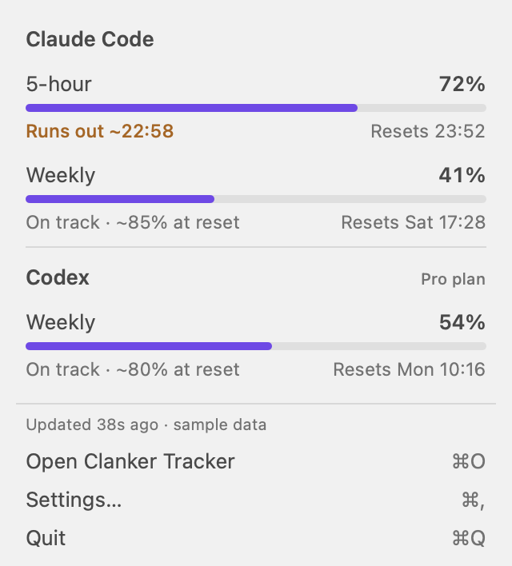
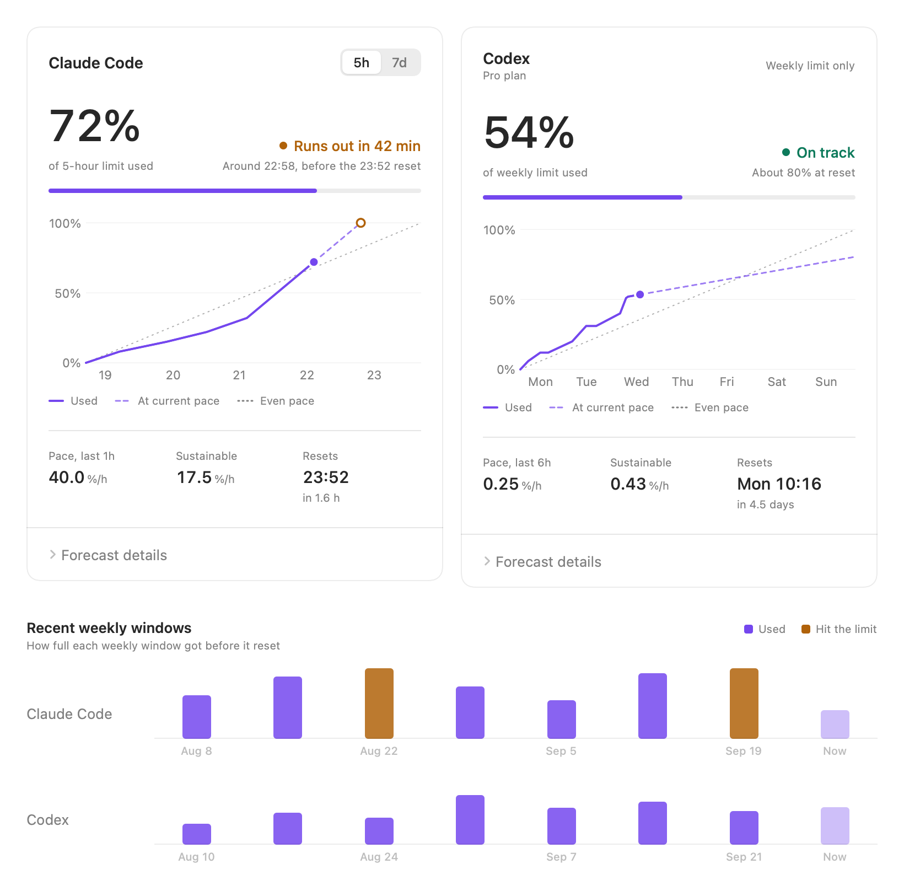
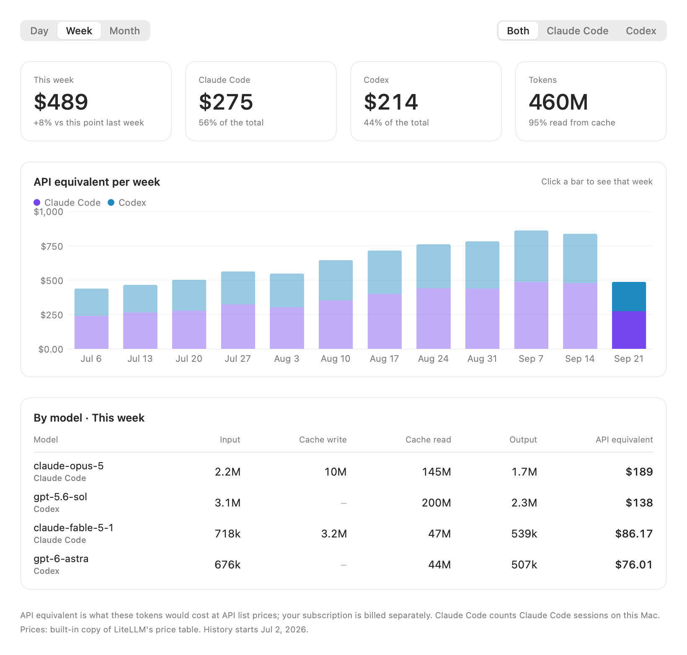

# Clanker Tracker

**A macOS menu bar app that tells you whether your Claude Code and Codex limits will last until they reset.**

It reads the limit data both tools already keep on your Mac, shows how much of each limit you've
used, projects your current pace forward, and warns you before you run out. It also works out what
your usage would cost at API list prices, like [ccusage](https://github.com/ryoppippi/ccusage), and
keeps that history so you can compare days, weeks and months. Everything is computed on your Mac
from files that are already there; the one download is a public price list, once a day.

<p align="center">
  <picture>
    <source media="(prefers-color-scheme: dark)" srcset="docs/popover-dark.png">
    
  </picture>
</p>

## Install with an agent

Paste this into Claude Code or Codex on the Mac you want to track:

```text
Install Clanker Tracker: download the latest release zip from https://github.com/iipanda/clanker-tracker with gh,
unzip it into ~/Applications (replacing any older copy), run ClankerTracker.app/Contents/MacOS/ClankerTracker --setup, and tell me what it printed.
```

`--setup` confirms Codex tracking, sets up the Claude Code collector, adds the app to login items,
and starts it. Add `--no-open-at-login` to leave your login items as they are.

## What it shows

- **Menu bar icon**: a ring that fills with whichever limit is closest to running out, plus its
  percentage. It matches the monochrome style of other menu bar icons, turns amber when your pace
  would hit 100% before the reset, and switches to a red countdown to the reset once you reach the limit.
- **Dropdown**: every limit at a glance, with used %, "Runs out ~15:02" or "On track", and when it resets.
- **App window**: per tool, a burn chart of the current window (recorded usage, projection at your
  current pace, and an even-pace line), pace vs. sustainable pace, forecast details, and how full
  your recent weekly windows got before they reset.
- **Spend**: the API-equivalent cost of your usage per day, week or month, per tool and per model,
  with the current period compared to the same point in the previous one. The dropdown shows today
  and this week, and each limit window shows what it has cost so far.
- **Quitting**: ⌘Q in the window closes the window and the app keeps tracking in the menu bar.
  To quit, right-click the menu bar icon → Quit Clanker Tracker, use Quit in the dropdown, or press ⌥⌘Q.
- **Notifications**: once per window when the forecast runs out before the reset, when usage
  passes a threshold (80% by default), and, if you turn it on, when a limit resets. On 5-hour
  limits, a spike gets its own alert ("runs out at 15:40 if you keep this pace"), which re-arms
  once the spike calms down so a later spike can alert again.

<picture>
  <source media="(prefers-color-scheme: dark)" srcset="docs/overview-dark.png">
  
</picture>

<picture>
  <source media="(prefers-color-scheme: dark)" srcset="docs/spend-dark.png">
  
</picture>

<sub>Screenshots use the sample data from <code>--demo</code>.</sub>

## How the forecast works

The forecast learns how you use each tool and projects the rest of the window from that:

- **Your usual hours**: from your past windows of the same kind (the last two weeks count most),
  how much you typically use in each hour of the day. It gets better as history builds up, mostly
  within the first week or two.
- **This window's intensity**: when the current window runs busier than your usual (judged mostly
  on the last day), the forecast assumes it stays that way, up to twice your usual rate.
- **Bursts fade**: a sudden spike, like an hour of heavy sub-agent work, carries on briefly and
  then settles into your usual pattern within about two hours (one hour for 5-hour limits). The
  last few hours are kept out of the learned pattern, so a burst counts as a one-off rather than a habit.
- **5-hour limits** blend this with your recent pace, which catches run-outs earlier.
- **Spikes on 5-hour limits**: when the last 30 minutes' pace would run the limit out but the
  forecast expects the spike to settle, the card and dropdown show "Runs out ~15:40 at this pace"
  and you get a one-off alert. It re-arms when your pace drops back well under what the limit can
  sustain.

The card's **Pace** is what you actually used over the last hour (5-hour limits) or 6 hours
(weekly), and **Sustainable** is the pace that lands exactly on 100% at the reset.

### Checked against your own history

`--backtest` replays past Codex windows: at every hour it gives each candidate estimator just what
was known at that moment and compares the prediction with what happened next. Across 64 weekly and
315 five-hour windows, the forecast above compared with the previous one (a straight line at the
last 6 hours' pace) came out like this:

| | Weekly | 5-hour |
| --- | --- | --- |
| Error in active hours, 12 h / 1 h ahead | 10.1 → 7.9 points | 5.0 → 4.7 points |
| Error in active hours, 24 h / 2 h ahead | 14.7 → 11.6 points | 8.5 → 7.2 points |
| Run-outs caught ahead of time | 32% → 60% | 70% → 62% (71% with spike alerts) |
| Warnings that came true | 55% → 59% | 43% → 49% (42% with spike alerts) |
| Typical error in the run-out time | 12.8 h → 8.7 h | 0.3 h → 0.4 h |

Run it on your own data with:

```sh
ClankerTracker --export-history /tmp/history.json    # read all logs once
ClankerTracker --backtest /tmp/history.json           # compare estimators
ClankerTracker --backtest /tmp/history.json --sweep   # tune parameters
ClankerTracker --backtest /tmp/history.json --learning  # accuracy vs weeks of history
ClankerTracker --backtest /tmp/history.json --spikes    # 5-hour warnings with spike alerts
```

## How the API-equivalent cost works

Every model response's tokens are read from the tools' own logs, split the way API prices are
(input, cache writes, cache reads, output), and kept as hourly totals per model. Cost is worked out
when shown, from the current prices:

- **Prices** come from [LiteLLM's public price table](https://github.com/BerriAI/litellm), the same
  source ccusage uses, downloaded at most once a day. A copy is built into the app for offline use.
- **Long-context rates** apply per request: GPT models above 272k prompt tokens, and older Claude
  models above 200k, cost more per token. Claude Code fast mode counts at twice the standard rate.
- **Each response counts once**: Claude Code repeats a response's usage on several lines (the
  largest output count wins), and Codex copies earlier responses into resumed and forked sessions
  (the original is kept, and a forked sub-agent's copy of its parent's history is left out).
- `codex-auto-review` is priced as `gpt-5.6-luna`, the same alias ccusage uses.

Checked against ccusage on the same logs: Claude Code matches exactly; Codex agrees on most days and
is within about 1% overall, the difference coming from how forked sub-agent sessions are counted.

## Where the data comes from

| Tool | Source | Updates |
| --- | --- | --- |
| **Codex** | Every model response writes a `token_count` event with `rate_limits` (the server's `used_percent`, window length and `resets_at`) to `~/.codex/sessions/**/rollout-*.jsonl`. | Within a second or two of each Codex response on this Mac. |
| **Claude Code** | Claude Code reports `rate_limits` to its status line command. The collector hooks into your status line (or sets one up) and saves them whenever they change. Token usage comes from its transcripts in `~/.claude/projects`. | While Claude Code is running. |

- **Codex**: the app tracks the main `codex` limit. The first launch reads all existing logs once
  (about 30 s for ~20 GB); after that it reads just the new lines as files grow.
- **Claude Code**: set up the collector from **Settings → Data sources** (or with `--setup` or
  `--install-collector`). It adapts to your status line:

  | Your status line | What the collector does |
  | --- | --- |
  | A shell script that reads `input=$(cat)` | Adds a marked block right after that line. The block saves `rate_limits` silently in the background, so your status line looks exactly as before. A copy of the script is kept as `<script>.clanker-backup`. |
  | Any other command (`npx ccstatusline`, a Python script, a one-liner, …) | Points `statusLine` at `~/.claude/clanker-statusline.sh`, which saves the limits, then runs your command with the same input and prints exactly what it prints. |
  | Claude Code's default | Points `statusLine` at the same script, which saves the limits and gives you a simple status line: `clanker · Opus · 5h 12% · 7d 40%`. |

  The collector edits just the `statusLine` entry in `~/.claude/settings.json`, leaves every other
  byte of the file as it was, and saves a backup as `settings.json.clanker-backup`. Settings shows
  the exact change before you install. **Remove** (or `--remove-collector`) restores your previous
  `statusLine` exactly, from a copy kept in the managed script. The collector uses `jq`, which
  ships with macOS 15 and later. Changes take effect in new Claude Code sessions.

Usage from other machines, or from claude.ai and Codex on the web, appears at the next local
reading. Until then the app shows the last known value and how old it is.

## Install

Requires macOS 26 or later.

**Download**: grab `ClankerTracker-<version>.zip` from
[Releases](https://github.com/iipanda/clanker-tracker/releases), unzip it, and move
**ClankerTracker.app** to Applications. Release builds are ad-hoc signed, so on first launch macOS
asks you to confirm: click **Done**, then **System Settings → Privacy & Security → Open Anyway**.
(Or run `xattr -dr com.apple.quarantine /Applications/ClankerTracker.app`.)

**Build from source** (needs Xcode 26 / Swift 6.2):

```sh
git clone https://github.com/iipanda/clanker-tracker.git
cd clanker-tracker
scripts/install.sh      # build, install, run --setup; or scripts/build-app.sh to build and install
```

Then:

1. Click the ring in the menu bar → **Settings…**
2. Under **Data sources**, click **Install collector** for Claude Code (open **What changes** first to see the edit).
3. Allow notifications when macOS asks, and turn on **Open at login** to keep it running.

Or run `ClankerTracker.app/Contents/MacOS/ClankerTracker --setup` once, which handles step 2 and the login item.

> [!TIP]
> Each rebuild gets a new ad-hoc signature, and macOS ties the notification and login-item
> permissions to it. To keep them across rebuilds, create a code-signing certificate named
> "Clanker Dev" in Keychain Access (Certificate Assistant → Create a Certificate → type
> *Code Signing*) and build with `CODESIGN_ID="Clanker Dev" scripts/build-app.sh`.

## Development

```sh
swift test                       # core logic: forecasts, parsers, file tailing, hook, notifications
INSTALL=0 scripts/build-app.sh   # build into build/ClankerTracker.app
open Package.swift               # work in Xcode
```

The binary takes a few flags that help while developing:

| Flag | What it does |
| --- | --- |
| `--setup [--no-open-at-login]` | Confirms Codex tracking, sets up the Claude Code collector, adds the login item, starts the app |
| `--dump` | Reads everything once and prints the current limits as JSON |
| `--explain` | Shows how each current forecast was made: your usual hours, this window's intensity, the hourly projection |
| `--export-history <file>` / `--backtest <file>` | Saves every limit window, then replays them to score forecast estimators (see above) |
| `--demo` | Runs with the sample data from `design/index.html` |
| `--snapshot <dir>` | Renders the dropdown and window panes to PNGs (combine with `--demo`) |
| `--install-collector` / `--remove-collector` | Sets up or removes the Claude Code collector (prints the settings.json change) |
| `--open-at-login [off]` | Adds the app to login items, or removes it |
| `--show-window` | Opens the main window at launch |

```sh
~/Applications/ClankerTracker.app/Contents/MacOS/ClankerTracker --dump
```

Set `CLANKER_TRACKER_DIR` to use a separate data folder, e.g. for a fresh backfill alongside your
real data.

### Releases

```sh
scripts/release.sh 0.2.0              # refresh built-in prices, test, universal build, zip, tag, publish
DRY_RUN=1 scripts/release.sh 0.2.0    # build and zip
```

Releases are ad-hoc signed today. With an Apple Developer ID, set `DEVELOPER_ID` (the certificate
name) and `NOTARY_PROFILE` (from `xcrun notarytool store-credentials`), and the same script signs
with the hardened runtime, notarizes, and staples the app, so it opens straight away.

### Layout

```
Sources/ClankerCore/      model, forecast estimators + backtest, log parsers, file tailing + FSEvents,
                          status line hook, notification rules. Pure logic, covered by Tests/ClankerCoreTests.
Sources/ClankerTracker/   the app: status item, popover, main window, settings (AppKit + SwiftUI)
design/index.html         the design board the UI follows
scripts/build-app.sh      bundle, sign, install
scripts/install.sh        build from source, install, run --setup
scripts/release.sh        universal build, zip, GitHub release
scripts/update-prices.py  refreshes the built-in price table from LiteLLM
```

### Data files

Everything lives in `~/Library/Application Support/ClankerTracker/`. It's the app's own record and
outlives the tools' logs: Claude Code deletes transcripts after 30 days by default, and your spend and
limit history stay here regardless.

- `spend.json`: hourly token totals per tool and model, kept for good. When the app re-reads the logs
  from scratch (e.g. after an update that changes how tokens are counted), it rebuilds just the
  period the remaining logs cover and keeps everything older.
- `history.json`: every limit window seen, compressed to the readings where usage changed, kept for
  good (about 1 MB a year). Forecasts learn from the most recent weeks.
- `spend-seen.bin`: which responses have been counted, so each is counted once.
- `prices.json`: the latest downloaded price table.
- `state.json`: how far into each log file the app has read.
- `claude/latest.json`, `claude/history.jsonl`: written by the collector.

A file the app finds unreadable is moved aside as `<name>.unreadable-<date>.json` rather than
overwritten, so it can be recovered.
